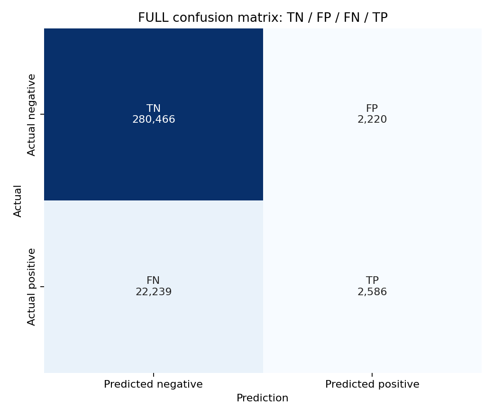
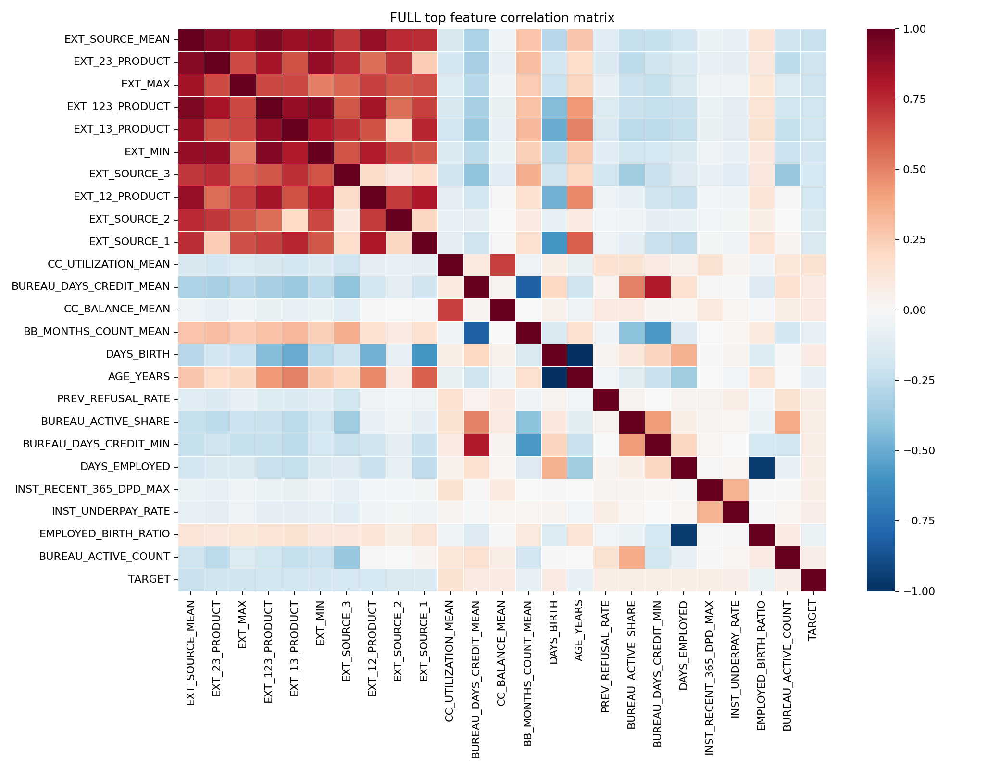

# FULL Model Spec

## Overview
- Model family: `weighted_blend`
- Model version: `full_weighted_blend_v2.2.0`
- Feature count: `269`
- Decision threshold for confusion matrix / accuracy: `0.35`
- Confusion-matrix rows: `307511`
- Selection candidate: `weighted_blend_full`
- Calibrator: `isotonic`

## Metrics
| Metric | Value |
| --- | ---: |
| AUC-ROC | 0.8338 |
| Accuracy | 0.9205 |
| Brier Score | 0.0634 |
| Default Rate | 0.0807 |

## Confusion Matrix

Counts: TN=280466, FP=2220, FN=22239, TP=2586.

Legend: TN=true negative, FP=false positive, FN=false negative, TP=true positive.

## Correlation Matrix

CSV table: [tables/full_correlation_matrix.csv](tables/full_correlation_matrix.csv)
