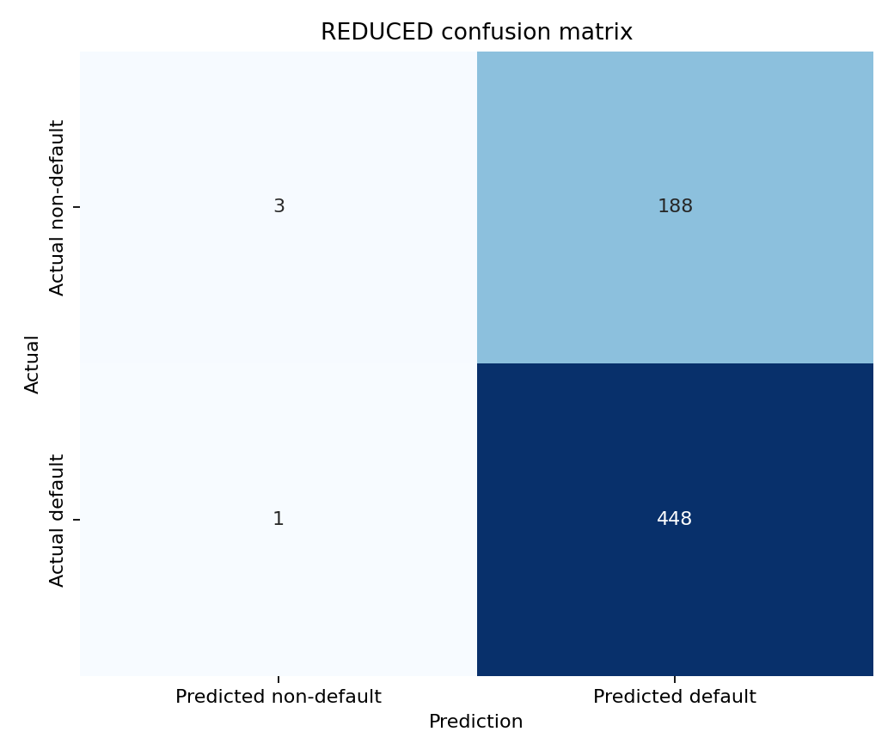
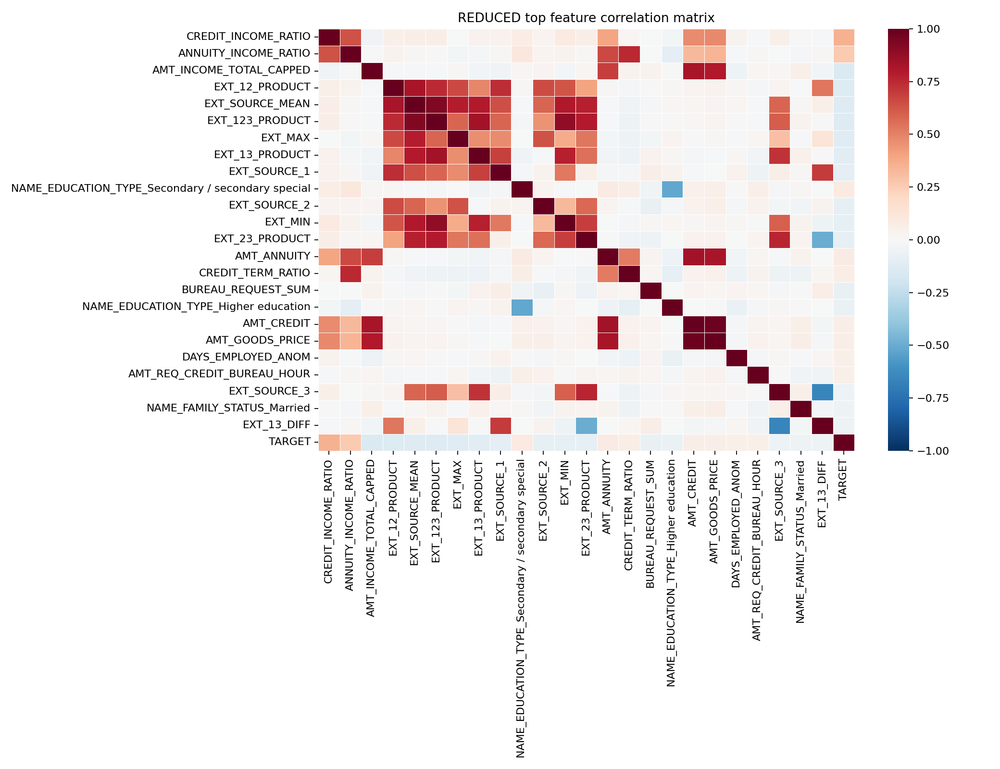

# REDUCED Model Spec

## Overview
- Model family: `xgboost`
- Model version: `reduced_v2.1.0`
- Feature count: `69`
- Decision threshold for confusion matrix / accuracy: `0.35`
- Selection candidate: `tuned_c`
- Calibrator: `isotonic`

## Metrics
| Metric | Value |
| --- | ---: |
| AUC-ROC | 0.6914 |
| Accuracy | 0.7047 |
| Brier Score | 0.1884 |
| Default Rate | 0.7016 |

## Confusion Matrix

Counts: TN=3, FP=188, FN=1, TP=448.

## Correlation Matrix

CSV table: [tables/reduced_correlation_matrix.csv](tables/reduced_correlation_matrix.csv)
