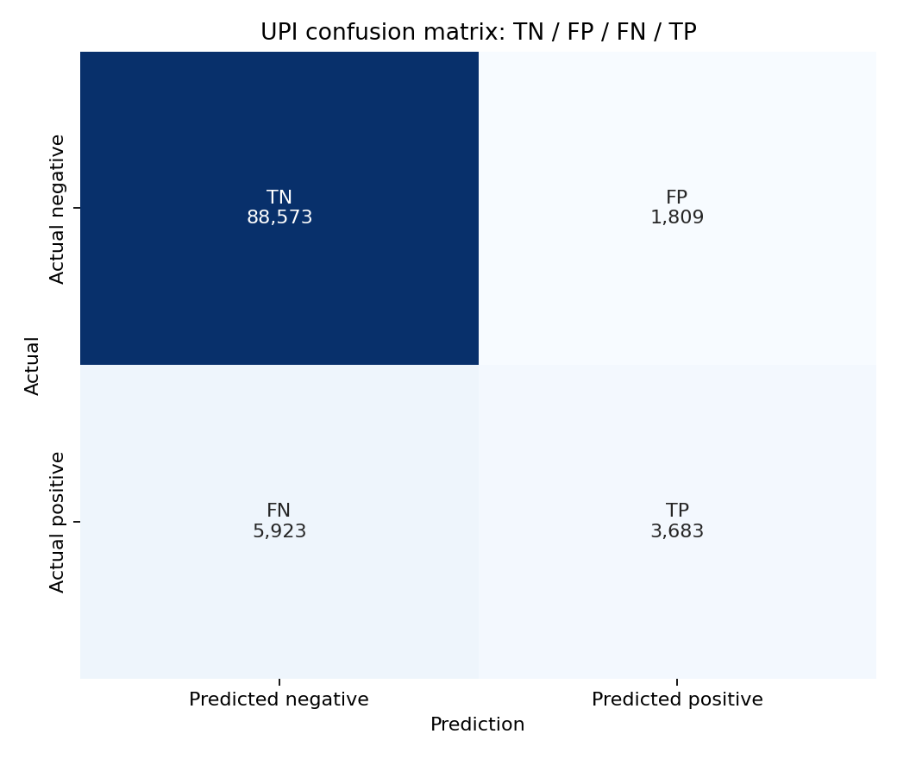
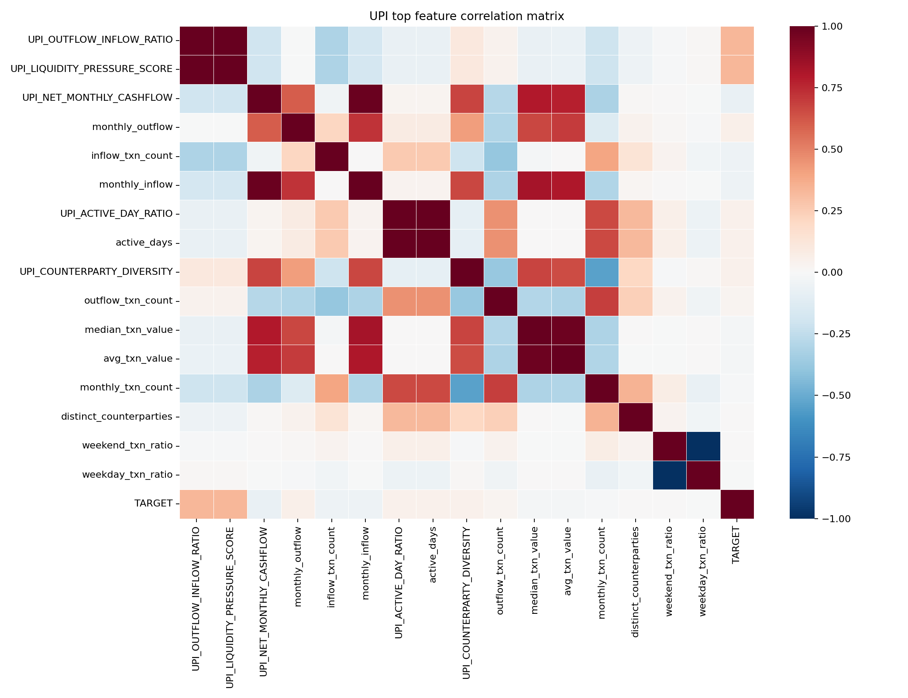

# UPI Model Spec

## Overview
- Model family: `xgboost`
- Model version: `upi_v1.1.0`
- Feature count: `17`
- Decision threshold for confusion matrix / accuracy: `0.35`
- Confusion-matrix rows: `99988`
- Selection candidate: `regularized_stable_upi`
- Calibrator: `isotonic`

## Metrics
| Metric | Value |
| --- | ---: |
| AUC-ROC | 0.8504 |
| Accuracy | 0.9227 |
| Brier Score | 0.0623 |
| Default Rate | 0.0961 |

## Confusion Matrix

Counts: TN=88573, FP=1809, FN=5923, TP=3683.

Legend: TN=true negative, FP=false positive, FN=false negative, TP=true positive.

## Correlation Matrix

CSV table: [tables/upi_correlation_matrix.csv](tables/upi_correlation_matrix.csv)
